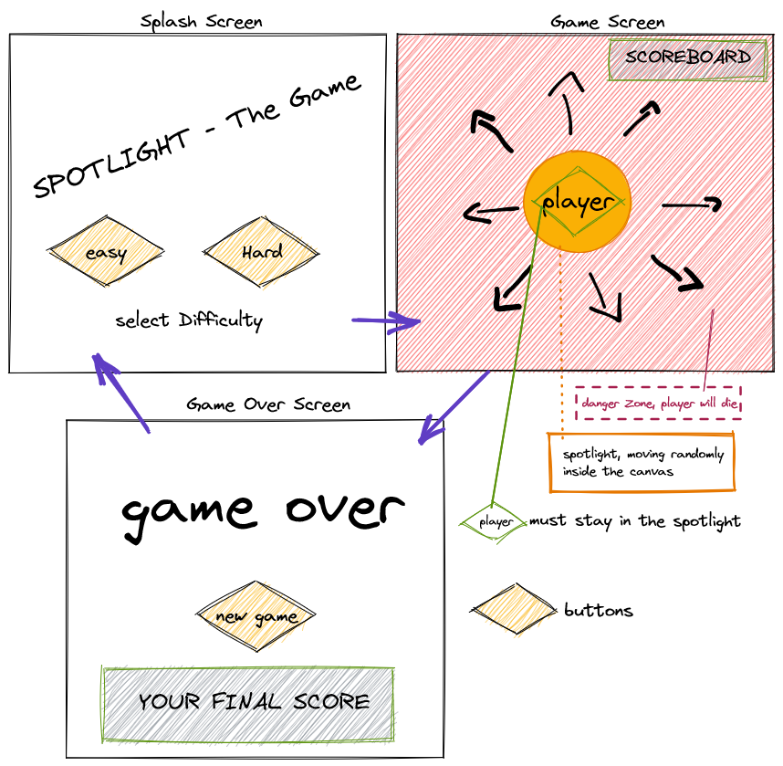

# spotlight

[Click here to see deployed game](https://ignazka.github.io/spotlight/)

## Description
a game, where the player has to stay in the spotlight.
the spotlight moves randomly.

## MVP
- game has one spotlight that moves randomly inside the 2 dimensional canvas
- player moves with mouse or arrow keys
- player has to stay inside the spotlight
- if the player leaves the spotlight, the game will end
- Increasing dificulty by speeding up the movement and scaling the size of the spotlight 

## Backlog
- scoreboard
- to choose at the beginning between easy and hard mode

## Data structure
# main.js

- buildSplashScreen () {}
- buildGameScreen () {}
- buildGameOverScreen () {}

# game.js

- Game () {}
- starLoop () {}
- checkCollisions () {}
- addSpotlight () {}
- clearCanvas () {}
- updateCanvas () {}
- drawCanvas () {}
- GameOver () {}

# player.js 

- Player () {
    this.x;
    this.y;
    this.direction;
    this.size
}
- draw () {}
- move () {}
- checkScreenCollision () {}

# spotlight.js 

- spotlight () {
    this.x;
    this.y;
    this.direction;
    this.size
}
- draw () {}
- move () {}
- checkCollisionBotton () {}

## States y States Transitions
- splashScreen
- gameScreen
- gameOverScreen

## Task
- main - buildDom
- main - buildSplashScreen
- main - addEventListener
- main - buildGameScreen
- main - buildGameOverScreen
- game - startLoop
- game - buildCanvas
- game - updateCanvas
- game - drawCanvas
- spotlight - draw
- spotlight - move
- game - addSpotlight
- player - draw
- player - move
- game - addPlayer
- game - checkCollision
- game - GameOver
- game - addEventListener

## Links

- [Trello Link](https://trello.com/b/Ek2regla/spotlight-the-game)
- [Slides Link](https://docs.google.com/presentation/d/1zyXykfXAMQfL4XaUv-koNWRjo5h-kRPNbhXdJ0ndQTg/edit?usp=sharing)
- [Github repository Link](https://github.com/ignazka/spotlight)
- [Deployment Link](https://ignazka.github.io/spotlight/)
